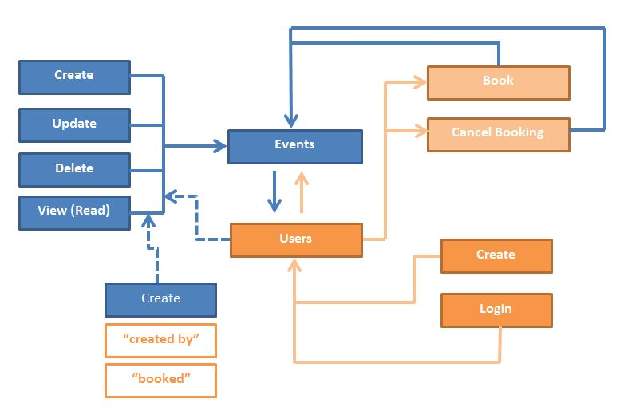

# favorite-events
This project is a small favorite event booking app con GraphQL, Node.js, MongoDB y React.js

## Graphql API design

[](https://heroku.com/deploy?template=https://github.com/StyvenSoft/favorite-events)



## Getting Started

### Setup Server

Clone this repo to your local machine using

```
$ git clone https://github.com/StyvenSoft/favorite-events.git

$ cd favorite-events
```
Install server dependencies

```
$ npm i
```

Create an [Atlas Account](https://docs.atlas.mongodb.com/getting-started) and Cluster

Create environment variables

`.env` 

```
MONGO_USER=<user>
MONGO_PASSWORD=<password>
MONGO_DB=<db>
```

Start the development server

```
$ npm run start
```

Open your browser and goto `localhost:4000/graphql`

## Graphql sample queries

```
query {
    events {
        _id
      	title
      	date
    }
}
```

```
query {
    events {
        _id
        title
        description
        price
        date
        creator {
            _id
            email
        }
    }
}
```

## Graphql Mutations

```
mutation CreateUser($email: String!, $password: String!) {
    createUser(userInput: {email: $email, password: $password}) {
        _id
        email
    }
}
```

```
mutation CreateEvent($title: String!, $desc: String!, $price: Float!, $date: String!) {
    createEvent(eventInput: {title: $title, description: $desc, price: $price, date: $date}) {
        _id
        title
        description
        price
        date
        creator {
            _id
            email
        }
    }
}
```